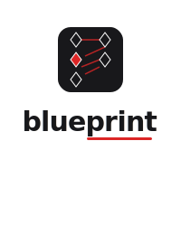

<p align="center">
  
</p>

# Blueprint — AI Product Manager Agent

An autonomous AI agent that takes a raw product idea and produces a complete product package: market research, competitive analysis, user stories, wireframes, PRDs, and development roadmap — all in one continuous workflow.

---

## Table of Contents

- [Overview](#overview)
- [Screenshots](#screenshots)
- [Architecture](#architecture)
- [Tech Stack](#tech-stack)
- [Getting Started](#getting-started)
- [API Reference](#api-reference)
- [Project Structure](#project-structure)
- [Development Approach](#development-approach)
- [Roadmap](#roadmap)

---

## Overview

**Blueprint** solves the #1 pain point for product managers: tool fragmentation. PMs currently use 6–8 tools across research, documentation, design, and roadmapping. Blueprint collapses this into a single AI-powered workflow:

```
Idea → Market Research → User Stories → Wireframes → PRD → Roadmap
```

### Key Features

- **Autonomous Market Research** — TAM/SAM/SOM estimates, competitor analysis, persona mapping, viability scoring
- **User Story Generator** — 10–15 structured stories with acceptance criteria, organized by epics, MoSCoW-prioritized
- **Wireframe Generator** — SVG wireframes generated from user stories with annotations and story traceability
- **PRD Builder** — Complete product requirements document auto-assembled from all prior artifacts
- **Development Roadmap** — Phased sprint plan with deliverables, timelines, and story assignments
- **Export** — Copy Markdown, download `.md`, or Print/Save as PDF

---

## Screenshots

### Landing Page
The hero section with logo, tagline, and CTA. Recent blueprints shown in a card grid below.

```
┌─────────────────────────────────────────────────┐
│                   [LEGO Icon]                    │
│                    blueprint                     │
│              ━━━━━━━━━━━━                        │
│                                                  │
│   An autonomous AI agent that takes a raw        │
│   product idea and produces a complete...        │
│                                                  │
│          [ Start a new product blueprint ]       │
│                                                  │
│   ┌──────────┐  ┌──────────┐  ┌──────────┐     │
│   │ Fitness  │  │ SaaS     │  │ E-com    │     │
│   │ AI       │  │ Dashboard│  │ Recs     │     │
│   │ Complete │  │ Draft    │  │ Stories  │     │
│   └──────────┘  └──────────┘  └──────────┘     │
└─────────────────────────────────────────────────┘
```

### Idea Input Dashboard (`/new`)

Product idea input with live pipeline progress: spinner, progress bar, step indicators with agent "thinking" messages.

```
┌─────────────────────────────────────────────────┐
│   What product are you building?                │
│                                                  │
│   [Project Name (optional)_____________________] │
│                                                  │
│   ┌─────────────────────────────────────────┐   │
│   │ A mobile app that uses AI to generate   │   │
│   │ personalized workout plans based on     │   │
│   │ user biometrics and available equip...  │   │
│   └─────────────────────────────────────────┘   │
│                                                  │
│   [████████████████░░░░░░░░░░░░░░░]  60%        │
│   3 of 5 steps complete                         │
│                                                  │
│   🔍 ✓ ── 📋 ✓ ── 🎨 ● ── 📄 ○ ── 🗺 ○       │
│   Research  Stories  Wireframes  PRD  Roadmap   │
│         ↻ Wireframes  Designing screen layouts   │
└─────────────────────────────────────────────────┘
```

### Project View (`/projects/[id]`)

Full results displayed in organized sections: research tables, priority-coded user stories with ACs, wireframe SVGs, PRD tables, roadmap cards.

```
┌─────────────────────────────────────────────────┐
│   Fitness AI App  [Complete]                    │
│   A mobile app that uses AI to generate...      │
│   [Copy Markdown] [Download .md] [Print/PDF]    │
│                                                  │
│   ── Market Research ──                         │
│   ┌──────┐ ┌──────┐ ┌──────┐ ┌──────┐         │
│   │ TAM  │ │ SAM  │ │ SOM  │ │Score │         │
│   │$4.2B │ │$890M │ │$45M  │ │78/100│         │
│   └──────┘ └──────┘ └──────┘ └──────┘         │
│   ┌─────────────────────────────────────────┐   │
│   │ Company   │ Strength │ Weakness │ Edge  │   │
│   │ Freeletics│ Brand    │ Generic  │ AI    │   │
│   └─────────────────────────────────────────┘   │
│                                                  │
│   ── User Stories ──                            │
│   ┌ US-001 [Onboarding] P0 Must ────────────┐  │
│   │ As a user, I want to input my...         │  │
│   │ • AC 1  • AC 2  • AC 3                  │  │
│   └──────────────────────────────────────────┘  │
│                                                  │
│   ── Wireframes ──                              │
│   ┌──────────────┐ ┌──────────────┐            │
│   │ [SVG Mockup] │ │ [SVG Mockup] │            │
│   └──────────────┘ └──────────────┘            │
│                                                  │
│   ── PRD ──                                     │
│   │ Goal        │ Metric     │ Target  │         │
│   │ Time to PRD │ Minutes    │ < 2 hrs │         │
│                                                  │
│   ── Roadmap ──                                 │
│   ┌ MVP — Core Features  [Weeks 1-4] ──────┐   │
│   │ • User auth     • Workout engine        │   │
│   │ • Biometric input • Basic AI plans      │   │
│   └──────────────────────────────────────────┘   │
└─────────────────────────────────────────────────┘
```

---

## Architecture

```
┌──────────────────────────────────────────────────┐
│                   UI Layer                        │
│          Next.js + Tailwind v4 + shadcn/ui       │
│  ┌────────┐  ┌──────────┐  ┌─────────────────┐  │
│  │ /      │  │ /new     │  │ /projects/[id]  │  │
│  │ Landing│  │ Input    │  │ Project View    │  │
│  └────────┘  └──────────┘  └─────────────────┘  │
├──────────────────────────────────────────────────┤
│               Agent Orchestration                │
│         5 Specialized AI Agents                  │
│  ┌──────────┐ ┌──────────┐ ┌──────────┐        │
│  │Researcher│ │ StoryGen │ │Wireframe │        │
│  └──────────┘ └──────────┘ └──────────┘        │
│  ┌──────────┐ ┌──────────┐                     │
│  │ PRD Gen  │ │ Roadmap  │                     │
│  └──────────┘ └──────────┘                     │
├──────────────────────────────────────────────────┤
│                AI Provider                       │
│         OpenCode Go (deepseek-v4-pro)            │
│         https://opencode.ai/zen/go/v1            │
├──────────────────────────────────────────────────┤
│              Data Layer                          │
│       File-based JSON store (data/*.json)       │
└──────────────────────────────────────────────────┘
```

### Pipeline Flow

```
User Input → POST /api/projects → Project Created
                                      ↓
           POST /api/projects/:id/research   → Agent: researcher.ts
                                      ↓
           POST /api/projects/:id/stories    → Agent: story-gen.ts
                                      ↓
           POST /api/projects/:id/wireframes → Agent: wireframe-gen.ts
                                      ↓
           POST /api/projects/:id/prd        → Agent: prd-gen.ts
                                      ↓
           POST /api/projects/:id/roadmap    → Agent: roadmap-gen.ts
                                      ↓
                               Project Complete
```

Each step can be triggered individually via its own API endpoint, or all at once via `/api/projects/:id/pipeline`.

---

## Tech Stack

| Layer | Technology |
|-------|-----------|
| **Framework** | Next.js 16 (App Router) |
| **Language** | TypeScript |
| **Styling** | Tailwind CSS v4 |
| **Components** | shadcn/ui (base-nova style) |
| **AI SDK** | Vercel AI SDK + `@ai-sdk/openai-compatible` |
| **LLM** | DeepSeek V4 Pro via OpenCode Go |
| **Icons** | lucide-react |
| **Storage** | File-based JSON store |

---

## Getting Started

### Prerequisites

- Node.js 18+
- An OpenCode Go API key ([subscribe here](https://opencode.ai/go))

### Setup

```bash
# Clone the repo
git clone https://github.com/ArafathUIU/Blueprint.git
cd Blueprint

# Install dependencies
npm install

# Set your API key
cp .env.example .env.local
# Edit .env.local: OPENCODE_GO_API_KEY=sk-...

# Start dev server
npm run dev
```

Open [http://localhost:3000](http://localhost:3000).

### Build for production

```bash
npm run build
npm start
```

---

## API Reference

### Projects

| Method | Endpoint | Description |
|--------|----------|-------------|
| `GET` | `/api/projects` | List all projects |
| `POST` | `/api/projects` | Create a new project `{ idea, name }` |
| `GET` | `/api/projects/:id` | Get a single project |

### Agents (step-by-step)

| Method | Endpoint | Description |
|--------|----------|-------------|
| `POST` | `/api/projects/:id/research` | Run market research agent |
| `POST` | `/api/projects/:id/stories` | Generate user stories |
| `POST` | `/api/projects/:id/wireframes` | Generate wireframes |
| `POST` | `/api/projects/:id/prd` | Assemble PRD |
| `POST` | `/api/projects/:id/roadmap` | Generate roadmap |

### Full Pipeline

| Method | Endpoint | Description |
|--------|----------|-------------|
| `POST` | `/api/projects/:id/pipeline` | Run all 5 agents sequentially |

### Example

```bash
# Create a project
curl -X POST http://localhost:3000/api/projects \
  -H "Content-Type: application/json" \
  -d '{"idea": "A fitness app powered by AI"}'

# Run the full pipeline
curl -X POST http://localhost:3000/api/projects/PROJECT_ID/pipeline
```

---

## Project Structure

```
src/
├── app/
│   ├── layout.tsx              # Root layout + header + TooltipProvider
│   ├── page.tsx                # Landing page + recent projects
│   ├── globals.css             # Red/black/white theme + shadcn base
│   ├── new/
│   │   └── page.tsx            # Idea input dashboard
│   ├── projects/
│   │   └── [id]/
│   │       └── page.tsx        # Project view with all artifacts
│   └── api/
│       └── projects/
│           ├── route.ts        # GET list / POST create
│           └── [id]/
│               ├── route.ts    # GET single project
│               ├── research/
│               ├── stories/
│               ├── wireframes/
│               ├── prd/
│               ├── roadmap/
│               └── pipeline/   # Full pipeline orchestrator
├── components/
│   ├── ui/                     # shadcn/ui components
│   ├── pipeline-progress.tsx   # 5-step progress indicator
│   └── export-buttons.tsx      # Markdown/Print export
├── lib/
│   ├── ai.ts                   # OpenCode Go client
│   ├── types.ts                # Full data model
│   ├── store.ts                # File-based project persistence
│   └── agents/
│       ├── index.ts            # Barrel export
│       ├── researcher.ts       # Market research agent
│       ├── story-gen.ts        # User story generator
│       ├── wireframe-gen.ts    # SVG wireframe generator
│       ├── prd-gen.ts          # PRD assembler
│       ├── roadmap-gen.ts      # Roadmap generator
│       └── pipeline.ts         # End-to-end orchestrator
└── public/
    ├── icon.svg                # LEGO brick favicon
    ├── logo-horizontal.svg     # Wordmark logo (light)
    ├── logo-vertical.svg       # Stacked logo
    └── logo-dark.svg           # Wordmark logo (dark)
```

---

## Development Approach

### Phase 0: Project Setup
- Initialized Next.js 16 with TypeScript and Tailwind CSS v4
- Integrated shadcn/ui with red/black/white theme using OKLCH color space
- Created custom LEGO brick SVG logo — red brick body with 3 studs, representing building blocks of product development
- Set up `TooltipProvider` wrapper in root layout

### Phase 0: Backend (Agents + API)
- **AI Client**: Connected to OpenCode Go (`deepseek-v4-pro`) via `@ai-sdk/openai-compatible`
- **Agent Architecture**: Each agent is a standalone function with structured system prompts and JSON output parsing
- **Store**: File-based JSON persistence (`data/*.json`) with CRUD operations — no database needed for MVP
- **Pipeline**: Sequential orchestrator that runs all 5 agents and catches errors per step

### Phase 1: Frontend (Dashboard + Project View)
- **Progress UX**: Animated spinner, color-coded step icons (🔍📋🎨📄🗺), cycling agent messages ("Designing screen layouts..."), percentage progress bar
- **Wireframe optimization**: Agent limited to 8-element SVGs with strict simple-shapes-only rules — cuts generation time significantly
- **Export**: Client-side Markdown generation from project data; Download `.md` and Print/Save PDF via browser print dialog
- **Landing page**: Shows recent projects in a responsive card grid with status badges

### Design Decisions
| Decision | Rationale |
|----------|-----------|
| No auth (deferred) | Keep MVP lean; `localStorage` + file store sufficient for solo PMs |
| File-based storage | Zero-setup persistence; no database dependency for early stage |
| Sequential pipeline (not parallel) | Each agent depends on prior output; sequential ensures data integrity |
| Client-side export | No server load for doc generation; instant Markdown/print |
| Minimal wireframe SVGs | Cuts LLM response time from 4+ min to ~60s without sacrificing clarity |

---

## Roadmap

### ✅ Phase 0: Setup
- [x] Logo (LEGO brick icon)
- [x] Next.js + Tailwind + shadcn/ui
- [x] Red/black/white theme

### ✅ Phase 1: Backend
- [x] OpenCode Go integration
- [x] Research Agent
- [x] Story Generator Agent
- [x] Wireframe Generator Agent
- [x] PRD Agent
- [x] Roadmap Agent
- [x] Full pipeline
- [x] Project store

### ✅ Phase 1: Frontend
- [x] Landing page with recent projects
- [x] Idea input dashboard with live progress
- [x] Project view with all artifacts
- [x] Export (Markdown, Print/PDF)
- [x] Animated progress with agent messages

### TODO: Phase 2
- [ ] Live SSE streaming for pipeline progress
- [ ] Voice input for product ideas
- [ ] Wireframe chat (natural language wireframe editing)
- [ ] Jira/Linear/GitHub integration for roadmap export
- [ ] Multi-format PRD export (Notion, Google Docs, Confluence)

### TODO: Phase 3
- [ ] User feedback ingestion and roadmap adjustment
- [ ] Competitor monitoring alerts
- [ ] Stakeholder sharing with read-only views

### TODO: Phase 4
- [ ] Template marketplace
- [ ] Team collaboration
- [ ] Analytics dashboard

---

## License

MIT
